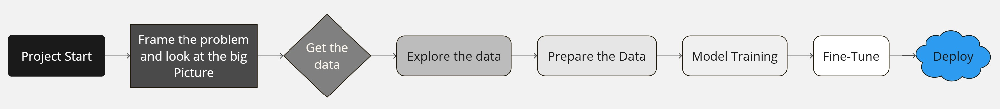

---

# Bank Marketing: Term Deposits Classification 📊

## Overview 

`Under Development`

This project aims to classify whether a client will subscribe to a term deposit based on historical marketing campaign data from a Portuguese banking institution. The data consists of phone calls made to clients and various client attributes.

## Table of Contents



1. [Frame the Problem and Look at the Big Picture](#frame-the-problem-and-look-at-the-big-picture-)
2. [Get the Data](#get-the-data-)
3. [Explore the Data](#explore-the-data-)
4. [Prepare the Data](#prepare-the-data-️)
5. [Short-List Promising Models](#short-list-promising-models-)
6. [Fine-Tune the System](#fine-tune-the-system-)
7. [Present Your Solution](#present-your-solution-)
8. [Launch](#launch-)
9. [How to Run the Project](#how-to-run-the-project-️)

## Frame the Problem and Look at the Big Picture 🔍

1. **Defining the Objective:**
   - The goal is to predict whether a client will subscribe to a term deposit based on features from previous marketing campaigns. 🎯
2. **Solution Usage:**
   - The solution will enable the bank to target potential customers more effectively, improving marketing campaign efficiency. 📈
3. **Current Solutions:**
   - The bank might use generic marketing strategies without targeted client predictions. 💬
4. **Problem Framing:**
   - This is framed as a supervised classification problem, where the aim is to predict a categorical outcome (subscription) using input features. 🔮
5. **Performance Measurement:**
   - Performance is measured using metrics such as accuracy, precision, recall, F1-score, and ROC-AUC. 📊
6. **Alignment with Business Objectives:**
   - These metrics align with the business objective of accurately predicting term deposit subscriptions. 🏆
7. **Minimum Performance Requirements:**
   - The minimum acceptable performance is determined by business needs, focusing on high precision and recall for the positive class. 🚀
8. **Comparable Problems:**
   - Similar problems include customer churn prediction and lead scoring, which may offer reusable tools and techniques. 🔄
9. **Availability of Expertise:**
   - Expertise in data science and marketing analytics is available to guide the development and interpretation of models. 👩‍💻
10. **Manual Solution Approach:**
    - Manually, analyzing customer data and marketing effectiveness helps target clients based on their likelihood to subscribe. 📝
11. **Assumptions:**
    - Assumptions include the relevance of provided features and the representativeness of historical data. 📜
12. **Verification of Assumptions:**
    - Verifying assumptions involves checking data distribution and feature relevance through exploratory data analysis and model validation. ✔️

## Get the Data 📥

1. **Data Requirements:**
   - The project requires historical marketing data, including client attributes and subscription outcomes. The dataset includes over 45,000 records with 34 columns. 📋
2. **Data Sources:**
   - Data is accessible on Kaggle: [Bank Marketing Term Deposits Classification](https://www.kaggle.com/datasets/saranyaponnarasu/bank-marketing-term-deposits-classification?select=Train.csv). 🌐
3. **Data Size and Storage:**
   - The dataset size is approximately 4.13 MB. 💾
4. **Legal Considerations:**
   - The dataset is licensed under Apache 2.0, and no additional authorization is required. 🏛️
5. **Access Authorizations:**
   - Ensure Kaggle account access for downloading the dataset. 🔑
6. **Workspace Setup:**
   - Create a local workspace and a virtual workspace on GitHub to manage the project. 🛠️
7. **Data Acquisition:**
   - Download the data files (`train.csv` and `test.csv`). 📥
8. **Data Format Conversion:**
   - Convert the data into a DataFrame format for analysis. 🔄
9. **Sensitive Information Handling:**
   - The dataset does not contain sensitive information. 🔒
10. **Data Type and Size Analysis:**
    - The data includes tabular data with client attributes and subscription outcomes and is a sample dataset. 📊

## Explore the Data 🔍

1. **Data Exploration Copy:**
   - Create a copy of the data for exploration, potentially sampling it down to a manageable size if necessary. 💾
2. **Exploration Documentation:**
   - Use a Jupyter [notebook](workspace/notebook/notebook.ipynb) to document the data exploration process. 📓
3. **Attribute Study:**
   - Examine each attribute’s characteristics, including name, type (categorical, int/float, etc.), percentage of missing values, and type of noise. 🔬
4. **Target Attribute Identification:**
   - Identify the target attribute(s) for supervised learning tasks, specifically `y` (subscription outcome). 🎯
5. **Data Visualization:**
   - Visualize the data to understand distributions and relationships. 📈
6. **Correlation Analysis:**
   - Study correlations between attributes to identify potential relationships. 🔗
7. **Manual Solution Approach Analysis:**
   - Analyze how the problem would be approached manually. 🧐
8. **Promising Transformations:**
   - Identify and plan promising transformations for the features. 🛠️
9. **Additional Data Needs:**
   - Determine if additional data could enhance the analysis (refer to “Get the Data” if needed). 📥
10. **Exploration Documentation:**
    - Document key findings and insights from the data exploration phase. 📝

## Prepare the Data ⚙️

1. **Data Cleaning:**
   - Address outliers and missing values by fixing or removing them, or by filling them with appropriate values. 🧹
2. **Feature Selection:**
   - Select relevant features by dropping those that do not contribute useful information for the task. 🔍
3. **Feature Engineering:**
   - Apply feature engineering techniques such as discretizing continuous features, decomposing features, adding transformations, and aggregating features. 🛠️
4. **Feature Scaling:**
   - Standardize or normalize features to ensure consistent scaling. 📏

## Short-List Promising Models 🏆

1. **Model Training:**
   - Train initial models using various classification algorithms, including logistic regression, decision trees, random forests, support vector machines (SVM), and gradient boosting machines. 🤖
2. **Performance Evaluation:**
   - Evaluate the performance of each model using cross-validation and metrics such as accuracy, precision, recall, F1-score, and ROC-AUC. 📊
3. **Variable Analysis:**
   - Analyze significant variables to understand which features contribute most to the predictions. 🔍
4. **Error Analysis:**
   - Investigate types of errors made by each model and identify patterns in misclassifications. 🕵️‍♂️
5. **Feature Engineering and Selection:**
   - Refine feature selection and engineering based on model performance. 🔧
6. **Model Comparison:**
   - Compare different models and select the top performers based on their classification metrics and generalization ability. 🏅

## Fine-Tune the System 🔧

1. **Hyperparameter Tuning:**
   - Fine-tune hyperparameters using cross-validation and consider random search or Bayesian optimization for exploring hyperparameter space. 🧩
2. **Ensemble Methods:**
   - Combine multiple models to improve performance. 🧠
3. **Final Performance Measurement:**
   - Assess the final model's performance on a test set to estimate generalization error without further tweaking. 📈

## Present Your Solution 🎤

1. **Documentation:**
   - Document the solution, including methods and findings. 📝
2. **Presentation Creation:**
   - Create a presentation highlighting the key aspects of the solution and its alignment with business objectives. 📊
3. **Explanation of Achievements:**
   - Explain how the solution meets the business objective and discuss any interesting findings. 🏆
4. **Visualization of Findings:**
   - Use visualizations to communicate key points and results effectively. 📉

## Launch 🚀

1. **Production Readiness:**
   - Prepare the solution for production, including integrating data inputs and writing unit tests. 🛠️
2. **Monitoring Setup:**
   - Implement monitoring code to track live performance and trigger alerts for performance drops or issues. 📡
3. **Model Retraining:**
   - Regularly update models with fresh data and automate the retraining process where possible. 🔄

## How to Run the Project 🏃‍♂️

1. **Clone the Repository:**
   ```bash
   git clone https://github.com/victorlcastro-dsa/Bank-Marketing-Term-Deposit-Classifier
   cd Bank-Marketing-Term-Deposit-Classifier
   ```

2. **Install Dependencies:**
   - Ensure you have Python 3.11.9+ installed.
   - Create a virtual environment and install the required packages.
   ```bash
   python -m venv venv
   source venv/bin/activate  # On Windows use `venv\Scripts\activate`
   pip install -r requirements.txt
   ```


## Credits and Acknowledgements 🙏

- Kaggle for providing the dataset.
- Various open-source libraries and tools used throughout the project.

## Contact 📬

For any questions or feedback, please reach out to my [email](mailto:victorlcastro.dsa@gmail.com).

Happy analyzing! 🎉

---